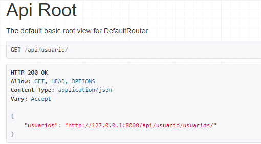
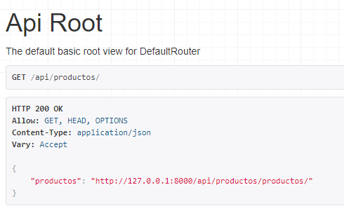
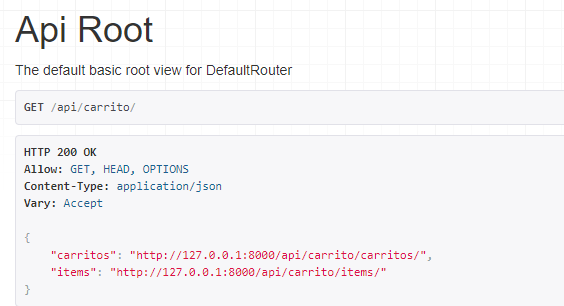

# Ecommerce Backend

Este es el backend del proyecto Ecommerce, desarrollado con Django y Django REST Framework. Este repositorio contiene todo el código necesario para configurar y ejecutar el backend localmente.

## Requisitos

Antes de comenzar, asegúrate de tener instalados los siguientes requisitos:

- Python 3.8 o superior
- Pip (el gestor de paquetes de Python)
- MySQL
- Git

## Instalación

Sigue los siguientes pasos para configurar y ejecutar el proyecto localmente.

1. Clona el repositorio

git clone https://github.com/M4gic1540/deploy-django-railway.git

luego hay que dirigirse a la carpeta del proyecto

cd deploy-django-railway

2. Crea y activa un entorno virtual

python -m venv venv

source venv/bin/activate # para Linux

`venv\Scripts\activate` # para Windows

3. Instala las dependencias

- pip install -r requirements.txt

4. Configura la base de datos

Utiliza SQlite3 para desplegar localmente

5. Realiza las migraciones de la base de datos

- python manage.py makemigrations

- python manage.py migrate

6. Crea un superusuario

- python manage.py createsuperuser

7. Ejecuta el servidor de desarrollo

- python manage.py runserver

si esta todo correctamente Configurado Deberia aparecer el siguiente mensaje:

### Endpoints de la API

(para poder ingresar a las vistas de DRF  debes estar logueado con el user creado anteriormente)

- /api/usuario/ - Endpoint para gestionar usuarios. 

- /api/productos/ - Endpoint para gestionar productos. 

- /api/carrito/ - Endpoint para gestionar el carrito de compras.
- /api/carrito/items/ Endpoint para gestionar items del carro de compras

